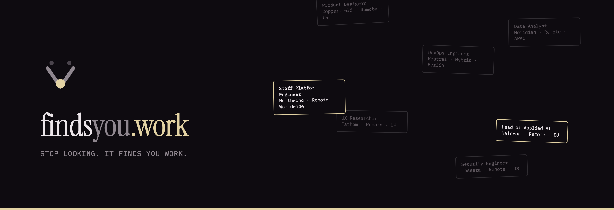

<p align="center">
  
</p>

<p align="center">
  
  
  
  
  
  
  
</p>

<p align="center">
  <b>findsyou.work</b> · a <a href="https://factory0.ventures">Factory Zero</a> venture
</p>

---

# The site

This repository is the marketing site for **FindsYou**: one page, one stylesheet
and one script, served by Cloudflare Pages. There is no framework, no bundler,
no build step and no runtime dependency. It was designed in Claude Design
(`FindsYou Landing.dc.html`) and ported to static HTML.

> **Stop looking. It finds you work.**

## The rule this site is built around

**Nothing is released.** The scan, the eligibility filter and the profile exist
as code in the private product repository, but no module is mounted on the
public Worker, so nothing here is usable. The only working thing on the site is
the waitlist. Every capability carries one of two labels, and the label sets the
tense of the sentence around it.

- **Shipping**: built, deployed, usable now. Present tense allowed only here.
  Today that is: this page, and the waitlist.
- **Planned**: named, unbuilt. Conditional tense, and a `planned` chip wherever
  it appears on the page.

A banner at the top of the page says so in the first sentence a visitor reads,
and [`llms.txt`](llms.txt) repeats it for machine readers, so an answer engine
cannot describe a planned feature as available.

The numbers on the page (483 scanned, 34 eligible, 18 worth it, 5 applied)
are an **illustration** of the intended shape, labelled as such in the section
itself. They are not measured output, because there is nothing to measure yet.

## The page

| Anchor | Section | Job |
| :--- | :--- | :--- |
| `/` | Hero | The claim, and a rain of listings where most fall through |
| `#number` | 01 / the number | 483 counts down to 18 as you scroll |
| `#wall` | 02 / the wall of no | **The signature screen.** Rejected listings, each stamped with the reason |
| `#remote` | 03 / why "remote" is a lie | The six eligibility questions, and a world map that dims as each is answered |
| `#how` | 04 / how it works | Three steps and the funnel |
| `#trust` | 05 / it won't make things up | The provenance refusal: "2 years" rejected against a CV that says "two years" |
| `#docs` | 06 / what you get | The CV and cover letter as objects |
| `#compare` | 07 / the comparison | Everyone else optimises for more. This optimises for fewer |
| `#price` | 08 / price | Free to scan. Paid documents are **planned**, not chargeable |
| `#waitlist` | Waitlist | The only form, and the only thing here that works |

Plus `404.html`, `llms.txt`, `sitemap.xml`, `robots.txt`, `site.webmanifest` and
`.well-known/security.txt`.

## Layout

```
.
├── index.html              the page, GENERATED, see below
├── 404.html
├── assets/
│   ├── findsyou.css        the whole design system, tokens at the top
│   ├── findsyou.js         reveal, the three scroll scenes, the waitlist
│   ├── world.svg           GENERATED, projected at build time, inlined into the page
│   ├── favicon.svg         the mark: things fall, one is caught
│   ├── org-avatar.png      GitHub org avatar, uploaded by hand
│   └── readme-banner.png   the banner above, GitHub only, not served
├── llms.txt                the structured summary for machine readers
├── robots.txt              AI crawlers welcomed by name
├── _headers  _redirects    Cloudflare Pages
└── tools/
    ├── build-page.py       emits index.html
    ├── build-map.py        emits assets/world.svg
    └── build-dist.sh       assembles dist/ for deploy
```

### Two files are generated, and both are committed

`index.html` and `assets/world.svg` are written by the scripts in `tools/`. The
**output is committed**, so a deploy ships exactly what the repository holds and
the site itself still has no build step. Re-run them only when the copy, the
card decks or the projection change:

```sh
python3 tools/build-map.py     # world.svg  (only when the projection changes)
python3 tools/build-page.py    # index.html (after any copy change)
```

`build-map.py` projects Natural Earth to plain SVG paths in about sixty lines of
Python, so the page ships **no d3, no topojson and no CDN call**. The design
canvas loaded ~300 KB of mapping libraries at runtime; this does the same work
once, at build time, for 27 KB gzipped.

## Development

There is no build step and no server requirement beyond static files:

```sh
python3 -m http.server 8000     # then open http://localhost:8000
```

## The waitlist

The form posts to `https://api.findsyou.work/v1/waitlist` with
`product: "findsyou"`: a separate Cloudflare Worker in
[`FindsYou-Work/waitlist-backend`](https://github.com/FindsYou-Work/waitlist-backend),
running the [Cratefield](https://cratefield.com) harness `waitlist` module with a
D1 database of its own.

The form is rendered `hidden` and revealed by JavaScript. A browser without JS
is shown a mail fallback instead of a control that cannot work. A honeypot field
catches bots, and tells them nothing.

## Deploy

```sh
./tools/build-dist.sh
npx wrangler pages deploy dist --project-name=findsyou
```

Use an API token for the Cloudflare account that owns `findsyou.work`. The
default `wrangler login` may be a different account, and the deploy then fails
with `Authentication error [code: 10000]`.

## Accessibility and motion

Motion is decoration. Under `prefers-reduced-motion` every scroll scene
collapses to an ordinary block, the stamps are already landed, and the page
reads as a plain document. Nothing is hidden until JavaScript runs, so a blocked
or failing script can never leave a section invisible.

## Licence

The code in this repository is MIT. The FindsYou name and mark are not.
